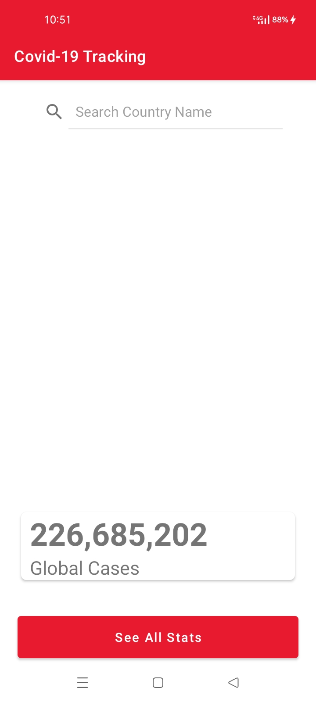

# Covid_Tracker 

live Coronavirus statistics from [Worldometers](https://www.worldometers.info/coronavirus/#countries) web site periodically. It uses Dataflow Kit to scrape source web site.

## To Be Added
- More Info About Covid 
- Search Feature Functionality

### Screenshots

  
### Support
- Found this project useful? Support by clicking the ⭐️.

# License 
MIT
